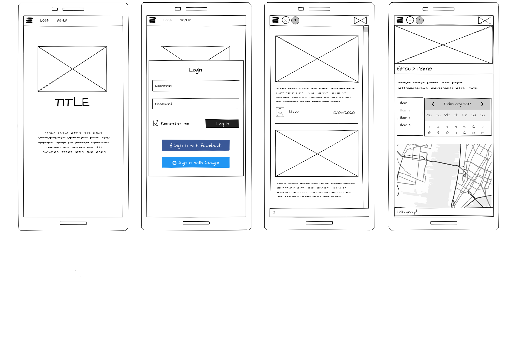
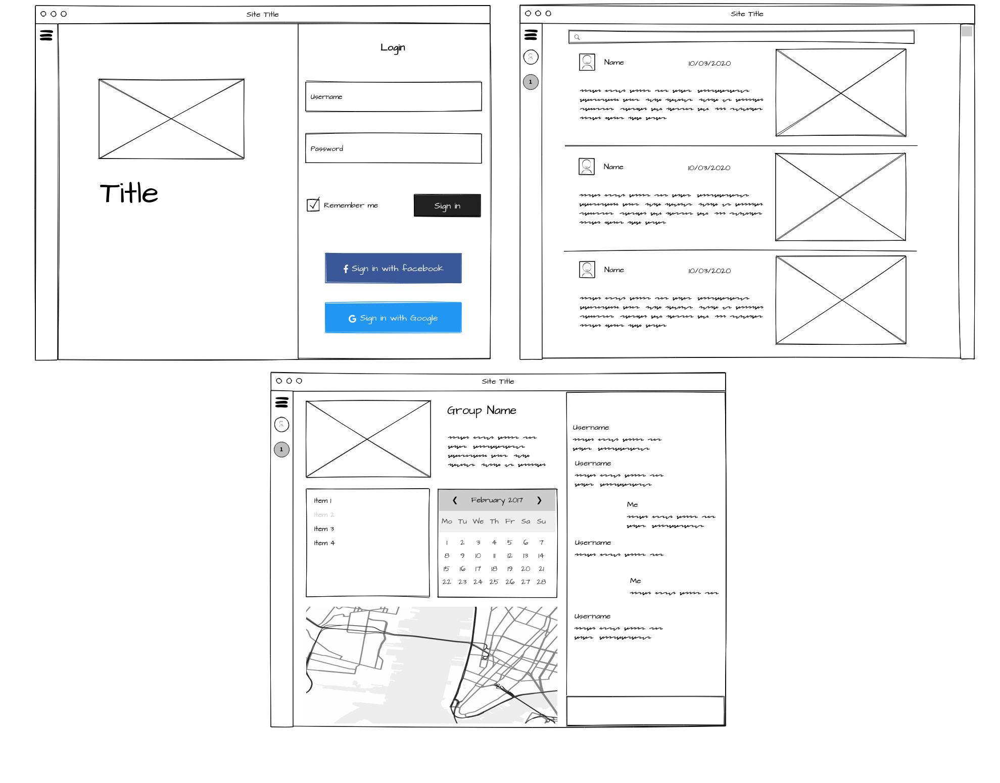
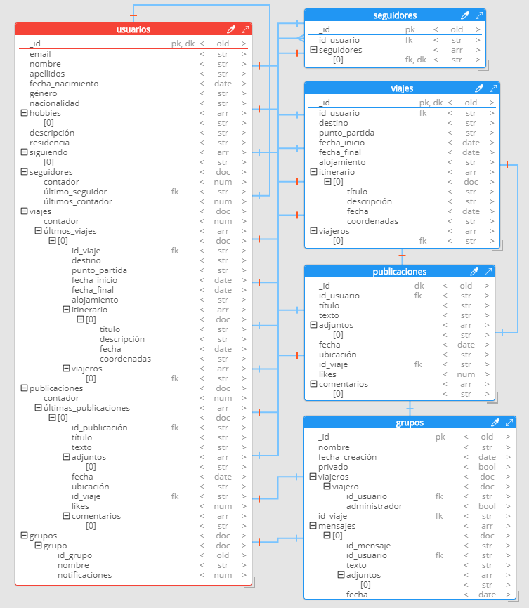
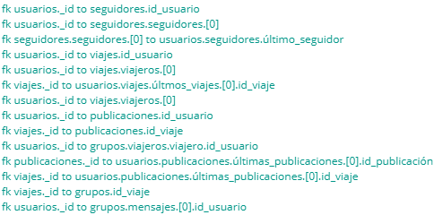

# Diseño

## Diseño de interfaces de usuarios

## Diagrama de Base de Datos

### Modelo Entidad/Relación

* *Las relaciones superpuestas tienen dirección usuarios-colección o colección-usuarios, nunca entre ellas (e.g. viajes-publicaciones, ya que esta no se superpone, como se puede comprobar).*

El sistema de base de datos utilizado en el desarrollo de la aplicación es MongoDB. Este es un sistema NoSQL, orientado a documentos y a diferencia de las bases de datos relacionales, MongoDB guarda los datos en documentos BSON (colecciones).
Para realizar la representación gráfica de la base de datos y sus colecciones se ha usado el programa [Hackolade](https://hackolade.com/), el cual está diseñado específicamente en torno a la desnormalización y la poderosa naturaleza polimórfica de los objetos y matrices anidados de JSON. El programa usa la siguiente simbología para mostrar las relaciones entre las colecciones de la base de datos:

Una barra perpendicular indica cardinalidad 1 y si no hay barra perpendicular la cardinalidad es 0. Si a mayores existe una trifurcación la cardinalidad sería (1, N) y (0, N) respectivamente.
En cuanto a los colores, el elemento con color azul significa clave ajena (foreign key), y
el color rojo clave primaria (primary key).

## Bibliografía y referencias.

- [Hackolade](https://hackolade.com/)
- [Google Chrome](https://www.google.com/intl/es_es/chrome/)
